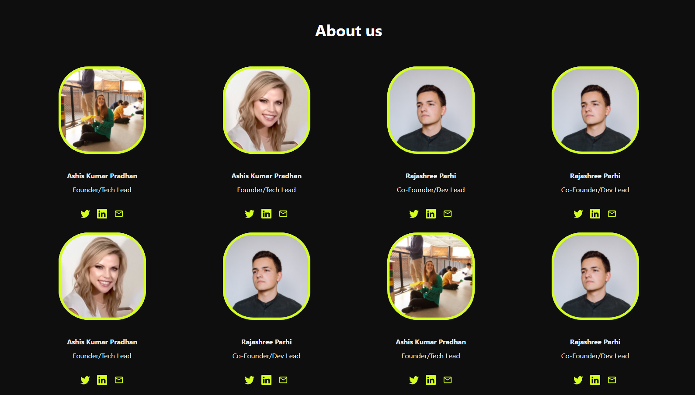

<h1 align="center">Bounty CHAINWHIZ - Team Section</h1>
<p>
  
  <a href="https://twitter.com/albertocruzdev" target="_blank">
    
  </a>
</p>

> This a web fow show Team Section for Chainwhiz Bounty.

<a href="https://chainwhiz-bounty-team-section.vercel.app/" target="_blank">
  
</a>

### ✨ [Demo](https://chainwhiz-bounty-team-section.vercel.app/)

## Install

```sh
npm install
```

## Usage

```sh
npm run dev
```

## Resources
[[CHAINWHIZ]- Implement a Team Section](https://app.chainwhiz.app/bounty/6241747d6bacaca7f6faa7d6)


## Author

👤 **Alberto Cruz Luis**

* Website: albertocruzluis.com
* Twitter: [@albertocruzdev](https://twitter.com/albertocruzdev)
* Github: [@AlbertoCruzLuis](https://github.com/AlbertoCruzLuis)
* LinkedIn: [@albertocruzluis](https://linkedin.com/in/albertocruzluis)

## Show your support

Give a ⭐️ if this project helped you!

***
_This README was generated with ❤️ by [readme-md-generator](https://github.com/kefranabg/readme-md-generator)_